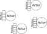
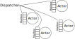

@@@section { data-background="#15a9ce" .unnudge }

### Strategies for Streaming

##### Arnout Engelen

##### Curry On 2018, Amsterdam

@@@

@@@section

@@@@section

Open Source toolkit for building Concurrent, Distributed, Resilient, Message-Driven applications on the Java Virtual Machine (JVM)


@notes[Before we dive in let me tell you what sparked me to tell this story: this was triggered by my work on the Akka team at Lightbend. might be interesting to do a quick show of hands who is more or less familiar with Akka?]

@@@@

@@@@section

Main building blocks:

* Actors (akka-actor)
* Streams (akka-streams)

@@@@@div { .fragment }

On top of those:

* Akka HTTP
* Akka Cluster
* Akka Persistence
* ...

@@@@@

@@@@@notes

Akka is a library available for Java and Scala that introduces 2 main abstractions: the first is the actor model, which provides a concurrency model based on message passing between entities we call Actors, and Akka Streams, which introduces an abstraction to talk about streaming data.

Akka Streams is implemented on top of Actors.

On top of those basic building blocks, the Akka toolkit provides all kinds of practical building blocks to make writing actual applications on top of these abstractions really nice.

@@@@@

@@@@

@@@@section

## Why a streams library?

@notes[The question that popped into my head is: why do we need Akka Streams at all? Akka is written in Scala, which is a nice expressive language, shouldn't we just express streams from basic language building blocks?]

@@@@

@@@

@@@section

1. Streaming systems
1. Strategies
1. Reactive Streams
1. Akka Streams
1. Demo
1. Beyond

@notes[as a quick agenda for the rest of this talk]

@@@

@@@section

## 1. Streaming systems

@span[Element by element] { .fragment }

@span['Fast Data'] { .fragment }

@span[Within a program] { .fragment }

@span[Java Virtual Machine (JVM)] { .fragment }

@span[Non-trivial, Ordered] { .fragment }

@notes[So what are 'streaming systems' for today? I think the defining characteristic is that these are systems that try to process data as soon as it arrives, where elements can be as low-level as bytes or byte buffers, or more high-level messages or entities. These will typically be networked applications, but today I'll focus on stream processing within a single program. Building larger systems out of such programs, or distributing streams over clusters like with Spark, is outside of the scope of today. While many of the concepts introduced are of course general, I will focus on the constraints of the JVM, and finally we'll start small, but try to look at what happens when we're really manipulating the data in the stream: interpreting, splitting, merging, etc.]

@@@

@@@section

@@@@section

## 2. Strategies

Naive copying:

```
while (buf = upstream.read()) {
  downstream.write(buf)
}
```

@@@@@div { .fragment }

On the JVM, threads are expensive:

* OS-level thread, stack, scheduling
* JVM-level stack, GC root

@@@@@

@notes[simplistic, blocking. fine for 1 stream. Many streams? threads expensive! context switching]

@@@@

@@@@section

### Desirable properties

1. Non-blocking (to reduce threads)

@notes[discovered]

@@@@

@@@@section

Non-blocking upstream:

```
upstream.setBlocking(false);

while (buf = upstream.read()) {
  downstream.write(buf)
}
```

@notes[Non-blocking at the flick of a switch: 'as much as possible'.]

@@@@

@@@@section

Non-blocking downstream:

```
downstream.setBlocking(false);

if (downstream.ready()) {
  while (buf = upstream.read()) {
    downstream.write(buf)
  }
}
```

@@@@

@@@@section

Non-blocking both?

```
upstream.setBlocking(false);
downstream.setBlocking(false);

while (buf = upstream.read()) {
  downstream.write(buf) // ???
}
```

@notes[decouple]

@@@@

@@@@section

3 flavours of non-blocking API:

* Return ASAP
* Asynchronous: Callbacks
* Asynchronous: Events

@notes[programming models called async. previously: actors message passing, no surprise]

@@@@


@@@@section

### Desirable properties

1. Non-blocking (to reduce threads)
1. Asynchronous (decouples reading/writing)

@@@@

@@@@section



@@@@

@@@@section



@notes[threads=cpus, single thread illusion]

@@@@

@@@@section

Message passing:

```
{
  case buf => downstream ! buf
}
```

@@@@

@@@@section { data-background-video="images/fishermen.mp4" }

# @span[OutOfMemoryError]{.orange .fragment}

@@@@

@@@@section

### Desirable properties

1. Non-blocking (to reduce threads)
1. Asynchronous (decouples reading/writing)
1. Back pressured (avoid overflowing memory)

@@@@

@@@@section

Back pressure is automatic with blocking I/O:

```
while (buf = upstream.read()) {
  downstream.write(buf)
}
```

@@@@@div { .fragment }

Async, information must travel in both directions:

```
{
  case buf             => downstream ! buf
  case ReadyForOneMore => upstream ! ReadyForOneMore
}
```

@notes[pingpong -> slow]

@@@@@

@@@@

@@@@section

Parallelism:

```
{
  case buf             => downstream ! buf
  case ReadyForMore(n) => upstream ! ReadyForMore(n)
}
```

@notes[stream processing with stages: start processing next element when previous element is not yet finished. flow parts flexibly reusable here?]

@@@@

@@@@section


@@@@

@@@@section

### Desirable properties

1. Non-blocking (to reduce threads)
1. Asynchronous (decouples reading/writing)
1. Back pressured (avoid overflowing memory)

@@@@

@@@

@@@section

@@@@section

## 3. Reactive Streams

@@@@

@@@@section { data-background="#489ebd" }

### Reactive Streams Timeline


@notes[Solving same problem. Industry together 'Reactive Streams working group' by Viktor Klang of the Akka Team (not limited to JVM). Consistent, interoperable. Next: goal]

@@@@

@@@@section { data-background="#489ebd" }

### Reactive Streams

is an initiative to provide a standard<br>
for <u>asynchronous</u> stream processing<br>
with <u>non-blocking</u> <u>back pressure</u>.


http://www.reactive-streams.org

@@@@

@@@@section

### `java.util.concurrent.Flow`

@@snip[rs]($root$/src/main/java/rs/Publisher.java) { #rs }
@@snip[rs]($root$/src/main/java/rs/Subscriber.java) { #rs }
@@snip[rs]($root$/src/main/java/rs/Subscription.java) { #rs }
@@snip[rs]($root$/src/main/java/rs/Processor.java) { #rs }

@notes[Most significant milestone was the inclusion of the RS interfaces in JDK9
If you're not on JDK9 you can use the org.reactivestreams library.]

@@@@

@@@@section

### Specifications

* 11-17 requirements (some subtle). Each.
* Technology Compatibility Kit (TCK)

@notes[simplicity is deceptive: TCK for conformance checking. Originally planned: both user-facing API and an interoperability API. User-facing scrapped ~2014 so libraries can provide their own, ideomatic impl.]

@@@@

@@@

@@@section

@@@@section

## 4. Akka Streams

@@@@

@@@@section


@@@@

@@@@section

@@snip[x]($root$/src/main/java/streams/Intro.java){#source-no}
@@snip[x]($root$/src/main/java/streams/Intro.java){#flow-no .fragment}
@@snip[x]($root$/src/main/java/streams/Intro.java){#sink-no .fragment}

@notes[Before we dive into the specifics, let's start with some small examples to get a feel]

@@@@

@@@@section

@@snip[x]($root$/src/main/java/streams/Intro.java){#source}
@@snip[x]($root$/src/main/java/streams/Intro.java){#flow}
@@snip[x]($root$/src/main/java/streams/Intro.java){#sink}
@@snip[x]($root$/src/main/java/streams/Intro.java){#graph .fragment}
@@snip[x]($root$/src/main/java/streams/Intro.java){#run .fragment}

@@@@

@@@@section

@@snip[x]($root$/src/main/scala/streams/Intro.scala){#source}
@@snip[x]($root$/src/main/scala/streams/Intro.scala){#flow}
@@snip[x]($root$/src/main/scala/streams/Intro.scala){#sink}
@@snip[x]($root$/src/main/scala/streams/Intro.scala){#graph .fragment}
@@snip[x]($root$/src/main/scala/streams/Intro.scala){#run .fragment}

@@@@

@@@@section

Java:

@@snip[x]($root$/src/main/java/streams/Intro.java){#short}

Scala:

@@snip[x]($root$/src/main/scala/streams/Intro.scala){#short}

@notes[we really try to make the API really easy to use for Java and Scala. LOOK AT TIME - can break here to skip materialization]

@@@@

@@@@section

## Materialization

@@snip[x]($root$/src/main/scala/streams/Materialization.scala){#multiple group="scala"}

@notes[running = 2-stage: build graph, run graph. run = materialization. Same graph can be materialized multiple times.]

@@@@

@@@@section

## Materialized values

@@snip[x]($root$/src/main/scala/streams/Materialization.scala){#source group="scala"}

@note[Streams and actors go well together, default left]

@@@@

@@@@section

## Materialized values

@@snip[x]($root$/src/main/scala/streams/Materialization.scala){#sink group="scala"}

@note[Streams and actors go well together, default left]

@@@@

@@@@section


@@@@

@@@@section

## Actor materialization

@@snip[x]($root$/src/main/scala/streams/Materialization.scala){#fusing group="scala"}


@notes[Advantage of 2-phase: reusable building blocks, but opportunity for optimizations at materialization time]

@@@@

@@@@section

# Fusing

@@snip[x]($root$/src/main/scala/streams/Materialization.scala){#fusing-explicit-async group="scala"}


@@@@

@@@@section

# Fusing

@@snip[x]($root$/src/main/scala/streams/Materialization.scala){#fusing-async group="scala"}


@@@@

@@@

@@@section

@@@@section

## 5. Demo

@@@@

@@@@section

## TCP Number Server

<!--

@@snip[x]($root$/src/main/scala/streams/TcpServer.scala) {#bind}
@@snip[x]($root$/src/main/scala/streams/TcpServer.scala) {#run .fragment}
@@snip[x]($root$/src/main/scala/streams/TcpServer.scala) {#flow .fragment}
-->

@@@@

@@@@section { data-background="images/alpakka.jpg" }

# @span[Alpakka]{.orange}

@@@@

@@@@section

## Alpakka

Community for Akka Streams connectors

@span[[https://github.com/akka/alpakka](https://github.com/akka/alpakka)]{.fragment}

@notes[A bit like Apache Camel, but for Akka Streams]

@@@@

@@@@section


@@@@

@@@

@@@section

@@@@section

## 6. Beyond

* Other approaches, e.g. fs2, Monix, ...
* Future JVM: Fibers/Project Loom
* Other ecosystems

@@@@

@@@

@@@section

@@@@section

# Questions?

@@@@

@@@@section


'Scala Spree' at ING tomorrow!

@@@@@div { .fragment }

# Thank you!

[https://akka.io](https://akka.io) [@akkateam](https://twitter.com/akkateam) [@raboofje](https://twitter.com/raboofje)

@@@@@

@@@@

@@@
